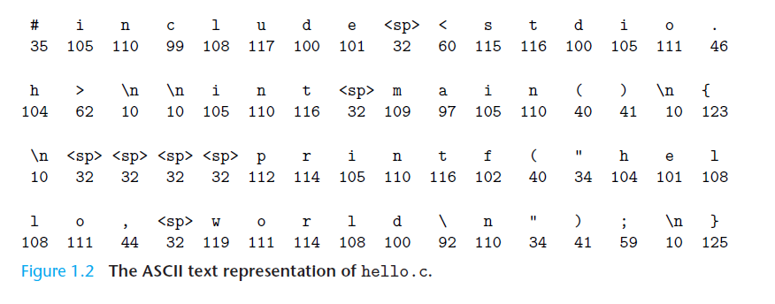
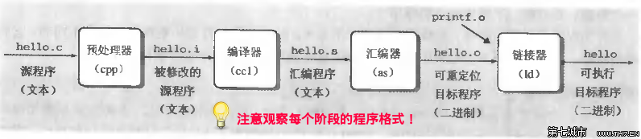
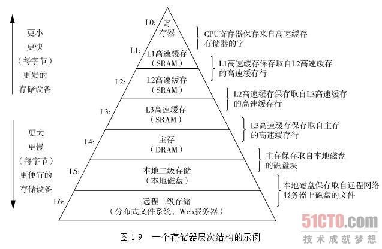
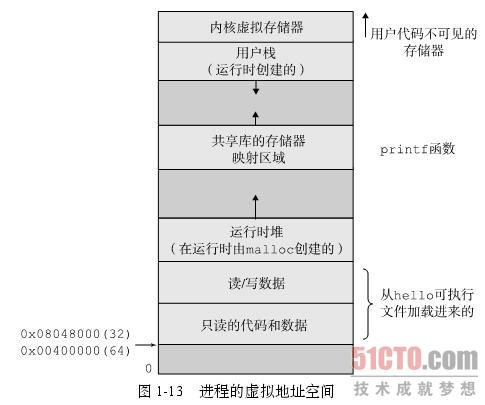

计算机系统漫游
===

通过跟踪`hello.c`程序的生命周期来开始对系统的学习。

    // hello.c
    #include <stdio.h>

    int main()
    {
      printf("hello, world\n");
    }

### 使用 位 + 上下文 表示信息

`Hello world`程序的生命周期是从一个源程序开始的。源程序实际上就是一个
由值0和1组成的位(bit)序列，8个位被组织成一组，成为字节。每个字节表示程
序中某个文本字符。

`1 byte = 8 bits`

用ASCII标准来表示文本字符，实际上就是用一个唯一的单字节大小的整数值来表
示每个字符。

如图：

像`hello.c`这样只有ASCII字符构成的文件成为**文本文件**，所有其他文件
被称为**二进制文件**。

`hello.c`表示的方法说明了一个基本的思想：系统中所有的信息——包括磁盘文
件、储存器中的程序等——都是由一串位表示的。区分不同数据对象的唯一办法是我
们读到这些数据对象时这些数据对象的上下文。

### 程序被其他程序翻译成不同的格式

每条C语句必须被转化成一些列的**低级机器语言指令**，然后这些指令按照一
种称为**可执行目标程序**的格式打包。目标程序也称为**可执行目标文件**。

`yuez> gcc -o hello hello.c`

这个翻译过程可分为四个阶段完成，执行这四个阶段的程序（**预处理器**、**
编译器**、**汇编器**、**连接器**）一起构成了**编译系统**。

1. **预处理阶段**。 在C中，cpp根据以`#`开头的命令，修改原始C程序。
2. **编译器**。 ccl将文本文件`hello.i`翻译成文本文件`hello.s`，
   它是一个**汇编语言程序**。
3. **汇编阶段**。汇编器（as）将`hello.s`翻译成机器语言指令，这些指
   令打包成叫**可重定位目标程序**的格式。
4. **链接阶段**。hello程序调用了`printf`函数，该函数存在于一个单独
   的`printf.o`的目标文件中，而这个文件必须以某种形式合并到`hello.o`
   中，而链接器（ld）就负责这种合并，最终得到**可执行目标文件**。

### 处理器读并解释存储在储存器上的指令

在`Shell`应用程序中执行

    yuez> ./hello
    // hello, world

    yuez>

为了了解`hello`运行时发生了什么，我们需要了解一个典型系统的硬件组成。

+ 总线

  贯穿整个系统的是一组电子管道，称为_总线_，它携带字节并负责在各个部件间传递。通常，
  总线被设计成传递定长的字节块，也就是字（word）。4 bytes or 8 bytes.

+ I/O设备

  I/O设备是系统与外部世界的联系通道。每个I/O设备都通过一个**控制器**或**适配器**与
  I/O总线相连。

+ 主存

  主存是一个临时存储设备，在处理器执行程序时，用来存放程序和程序处理的数据。从物理
  上讲，主存是由一组动态随机存取储存器芯片组成；从逻辑上讲，储存器是一个线性的字节
  数组，每个字节都有其唯一的地址（数组索引）。

+ 处理器

  CPU，是解释（或执行）储存在主存中指令的引擎。CPU在指令的要求下可能会执行一下操作：
  + **加载**：把一个字节或者一个字从主存复制到寄存器，以覆盖原来的内容。
  + **存储**：把一个字节或者一个字从寄存器复制到主存的某个位置，以覆盖这个位置上原
    来的内容。
  + **操作**：把两个寄存器的内容复制到ALU，ALU对这两个字节做算术操作，并将结构存放
    到一个寄存器中，以覆盖该寄存器原来的内容。
  + **跳转**：从指令本身中抽取一个字，并将这个字复制到程序计数器（PC）中，以覆盖PC
    中原来的值。

### 运行hello程序

初时时，Shell程序执行它的指令，等待我们输入一个命令。当我们在键盘上输入字符串"./hello"
后，Shell程序将字符逐一的读入寄存器中，再把它放到存储器中。

当我们在键盘上按下回车后，Shell程序执行一系列的指令来加载可执行hello文件，将hello
目标文件中的代码和数据从磁盘复制到主存。

一旦目标文件hello中的代码和数据被加载到主存，处理器就开始执行hello程序的main程序中
的机器语言指令。这些指令将"hello, world\n"字符串中的字节从主存复制到寄存器文件，
再从寄存器文件中复制到显示设备。

### 高速缓存至关重要

处理器从寄存器文件中读取数据的速度比从主存中读取几乎快100倍，而且这种差距还在变大。
针对这种处理器与主存之间的差异，设计者采用了更小、更快的存储设备，即**高速缓存存
储器**，用来存放处理器近期可能会需要的信息。

### 存储设备行程层次结构

实际上，每个计算机系统中的存储设备都被组织成了一个**存储器层次结构**。

### 操作系统管理硬件

操作系统有两个基本的功能：1）防止硬件被失控的应用程序滥用。2）想应用程序提供简单
一致的机制来控制复杂而又通常大相径庭的底层硬件。操作系统通过**进程、虚拟存储器、
和文件**来实现这两个功能。

### 进程

进程是操作系统对一个正在运行的程序的一种抽象。进程也是对处理器、主存和I/O设备的
抽象表示。

hello程序实例场景中有两个并发的进程：Shell进程和hello进程。

### 线程

一个进程可以由多个称为线程的执行单元组成，每个线程都运行在进程的上下文中，并共享
同样的代码和全局数据。

### 虚拟存储器

虚拟存储器是一个抽象概念，它为每个进程提供了一个假象，即每个进程都在独占地使用主存，
每个进程看到的都是虚拟存储器，称为**虚拟地址空间**。

每个进程看到的虚拟地址空间由大量准确定义的区构成，每个区都有专门的功能。

+ **程序代码和数据**。对于所有的进程来说，代码是从同一固定地址开始的。大小是固定的。
+ **堆**。代码和数据区后紧随的是运行时堆。堆可以在运行时动态地扩展和收缩。
+ **共享库**。
+ **栈**。位于用户虚拟地址空间顶部的是用户栈，编译器用它来实现函数调用。
+ **内核虚拟存储器**。内核总是驻留在内存中，是操作系统的一部分。

### 文件

文件就是字节序列。每个I/O设备都可以视为文件。系统中所有的输入输出都是通过使用一小
组成为 Unix I/O 的系统调用读写文件来实现的。

### 系统之间利用网络通信

从一个单独系统来看，网络可视为一个I/O设备。

*****

## 小结

计算机系统是由硬件和系统软件组成的，它们共同协作以运行应用程序。计算机内部的信息
被表示为一组组的位，它们根据上下文有不同的解释方式。

处理器读取并解释存放在主存里的二进制指令。

操作系统内核是应用程序和硬件之间的媒介。它提供三个基本的抽象：1）文件是对I/O设备
的抽象；2）虚拟存储器是对主存和磁盘的抽象；3）进程是对处理器、主存和I/O设备的抽象。

最后，网络提供了计算机系统之间的通讯手段。从特殊系统角度看，网络就是一种I/O设备。
